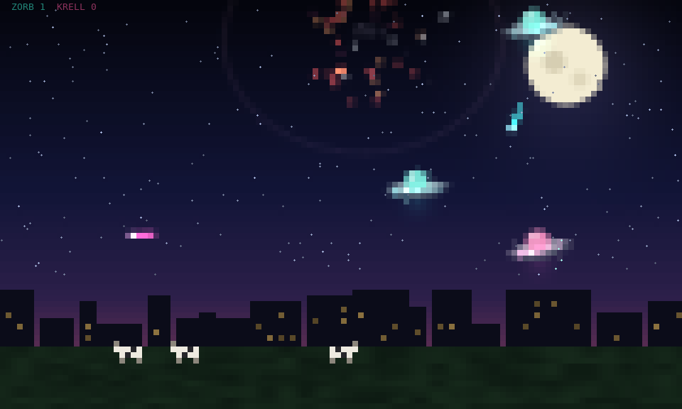

# LLM Dogfight



**A UFO dogfight in your terminal, flown by two small language models running on your own
machine.** Type `dogfight`. Team ZORB and team KRELL, each commanded by a different local model,
start fighting over a sleeping city: they chase, retreat, steal cows, shout at each other, and
learn from every saucer they lose. Any key ends it.

Works in the default Ubuntu terminal (GNOME Terminal / Ptyxis) and any other truecolor
terminal, on Linux and macOS, with no graphics protocol: it is plain text, drawn with
half-blocks and braille. The binary is a 0.7 MB Rust program with one dependency; the models
run in a small Python sidecar on CUDA or Apple MLX and fit an 8 GB GPU.

## Quick start

```sh
# 1. the tool (Rust toolchain: https://rustup.rs), or a release binary from the Releases page
cargo install --git https://github.com/AlveeeRahman/llm-dogfight

# 2. a model runtime (one of these)
pip install torch transformers    # NVIDIA GPU with 8 GB or more (a CUDA build of torch)
pip install mlx-lm                # Apple silicon Mac

# 3. play
dogfight                           # first run downloads the two default models (~5 GB)
```

No GPU? `dogfight ufo` runs the same dogfight with the built-in pilots and needs nothing but
the binary.

## Commands

| command | what it does |
|---|---|
| `dogfight` | start a battle; picks CUDA, or MLX on Apple silicon |
| `dogfight cuda` / `dogfight mlx` | start a battle with the backend chosen by hand |
| `dogfight evolve` | start a battle where a genetic algorithm also evolves each team's tactics |
| `dogfight ufo` | the built-in pilots: no models, no GPU |
| `dogfight models` | the model catalogue and what fits your GPU |
| `dogfight --zorb MODEL --krell MODEL` | pick the two commanders (an alias from the catalogue or any Hugging Face id) |
| `dogfight arena check --load` | verify Python, GPU and models; load both and time a decision |
| `dogfight arena pull` | download the models ahead of time |
| `dogfight arena lessons` | what each commander has learned so far |
| `dogfight reset model \| score \| all` | forget the lessons, the games won, or both |
| `dogfight install` / `dogfight uninstall` | optional screensaver mode: play whenever your shell sits idle |
| `dogfight remove` | delete everything dogfight put on the machine: config, memories, downloaded models, itself |

Options for a battle: `--lessons on|off`, `--fps N`, `--seed N`, `--duration SECS`,
`--perf FILE`. `dogfight --help` lists everything.

## How a battle works

**Rules.** Each team has 4 saucers on screen. A destroyed saucer is replaced 4 s later from a
budget of 20 reinforcements per game; when a team has nothing in the air and nothing left to
send, it loses the game. Ten seconds later the next game starts, and the loser fields an extra
saucer. Score is kills plus cows abducted; games won are remembered per model pair. A game
lasts about a minute and a half. Every kill, reinforcement, abduction and result is one line in
`~/.local/state/dogfight/match.log`.

Saucers fire one bolt at a time: the next shot comes 200 ms after the previous one has hit or
faded, so a fight is a stream of single shots rather than volleys.

**Commanders.** About once a second each model receives a compact text description of the
situation (its saucers with hit points, nearest enemy and nearest cow, the enemy's saucers,
recent events, the enemy's last battle cry) and answers with one order per saucer:
`attack E4`, `hunt`, `flee` or `abduct C1`. The orders are flown by the same steering code as
the built-in pilots, so the fight stays smooth no matter how slow or confused a model is.
When a team loses a saucer, its commander shouts a battle cry that shows in the HUD.

**Learning.** After every loss the commander is shown the post-mortem (who killed the saucer,
from what range, what it was doing, how long it had been flying damaged, how outnumbered it
was) and writes one rule to avoid that fate. Rules stay in its prompt for the rest of the
session and persist on disk, so a pair of models keeps evolving across battles. Nothing is
fine-tuned; this is in-context learning, which is what fits next to a game on an 8 GB card.

**Doctrine.** Each team flies under a *doctrine*: six tactical parameters with hard bounds
(when a damaged ship must flee, when fleeing is forbidden, how much of the fleet may retreat
at once, how often to focus fire, and advice on when a cow is worth going for). It is spelled
out in the model's prompt, and the flee rules are enforced on every order: small models
otherwise drift into retreating with healthy ships, and both sides must play the same game.
Abducting is never corrected. It is the model's own call, and it is the most telling one: a
commander that leaves the fight for a cow when the enemy is far is reading the field and
weighing points against risk; one that beams cows under fire is greedy; one that never goes
for a cow at all is either cautious or simply not reading the openings the prompt spells out.

**Evolve.** With `dogfight evolve`, a genetic algorithm scores each team's active doctrine over
every game (kills minus losses plus half the cows, per minute) and breeds the next generation
from the best ones, separately for the two teams and in parallel. The model explores tactics
only inside a heuristic envelope, and the envelope is what evolves. It runs in Rust with no
extra model calls, so it costs nothing; populations persist per team in
`~/.local/state/dogfight/doctrine-*.txt` and `dogfight arena lessons` shows them.

## Models

The defaults are `Qwen/Qwen3-0.6B` for ZORB and `HuggingFaceTB/SmolLM2-1.7B-Instruct` for
KRELL: two families, both ungated, 4.6 GB of GPU memory together. `dogfight models` prints the
catalogue with sizes and whether each entry fits 8 GB next to your other model. Every listed
model is **ungated**: no licence click-through, no token.

| alias | model | bf16 | notes |
|---|---|---|---|
| `qwen3-0.6b` | Qwen/Qwen3-0.6B | 1.5 GB | default for ZORB; fast and decisive |
| `qwen3-1.7b` | Qwen/Qwen3-1.7B | 4.1 GB | stronger Qwen; pair it with a small partner |
| `qwen2.5-0.5b` | Qwen/Qwen2.5-0.5B-Instruct | 1.0 GB | tiny and quick |
| `qwen2.5-1.5b` | Qwen/Qwen2.5-1.5B-Instruct | 3.1 GB | |
| `smollm2-360m` | HuggingFaceTB/SmolLM2-360M-Instruct | 0.7 GB | under 1B: often skips the order format |
| `smollm2-1.7b` | HuggingFaceTB/SmolLM2-1.7B-Instruct | 3.4 GB | default for KRELL |
| `gemma3-1b` | unsloth/gemma-3-1b-it | 2.0 GB | Google's Gemma 3 1B, ungated mirror |
| `lfm2-1.2b` | LiquidAI/LFM2-1.2B | 2.3 GB | Liquid AI, built for on-device use |
| `lfm2-700m` | LiquidAI/LFM2-700M | 1.5 GB | under 1B: often skips the order format |
| `olmo2-1b` | allenai/OLMo-2-0425-1B-Instruct | 3.0 GB | fully open training recipe; likes to abduct |
| `falcon3-1b` | tiiuae/Falcon3-1B-Instruct | 3.3 GB | |
| `danube3-500m` | h2oai/h2o-danube3-500m-chat | 1.0 GB | under 1B: often skips the order format |
| `deepseek-r1-1.5b` | deepseek-ai/DeepSeek-R1-Distill-Qwen-1.5B | 3.6 GB | thinking model: slower, chatty |
| `granite3.3-2b` | ibm-granite/granite-3.3-2b-instruct | 5.1 GB | `lm_quant = "8bit"` next to a partner |
| `smollm3-3b` | HuggingFaceTB/SmolLM3-3B | 6.2 GB | `lm_quant = "8bit"` next to a partner |
| `qwen2.5-3b` | Qwen/Qwen2.5-3B-Instruct | 6.2 GB | `lm_quant = "8bit"` next to a partner |

```sh
dogfight --zorb lfm2-1.2b --krell gemma3-1b       # try a pair once
dogfight arena check --load                        # confirm both load and see the peak GPU memory
```

The sidecar caps itself at your card's memory minus 2 GB (`lm_vram_gb`), so a bigger card
simply allows bigger pairs; an out-of-memory error names the cap and the ways around it.
Pairs played through full battles on an RTX 4000 Ada (20 GB) while this was written:

```sh
dogfight --zorb qwen3-0.6b --krell smollm2-1.7b         # the defaults, 4.6 GB
dogfight --zorb qwen3-0.6b --krell gemma3-1b            # 3.6 GB
dogfight --zorb deepseek-r1-1.5b --krell qwen3-1.7b     # 7.9 GB: a card above 8 GB, or lm_quant = "8bit"
```

An alias that is not in the catalogue is refused with a hint rather than started; a Hugging
Face id (`org/name`) is always accepted as typed.

No Hugging Face account or token is needed for any of them. If a download fails with
"rate-limiting anonymous downloads (HTTP 429)", Hugging Face is throttling your IP after many
anonymous requests; wait a few minutes, or set `HF_TOKEN` to a free read token for a higher
limit. To keep a pair, set `lm_model_a` and `lm_model_b` in the config. Any Hugging Face model with
a chat template and safetensors weights works; append `@<commit>` to pin the weights. On MLX
the same ids work through mlx-lm, and the `mlx-community/*-4bit` repos are smaller and faster.
Sizes above are bf16 safetensors as reported by the Hugging Face API in September 2026. The
defaults and the 1B-class entries (Gemma 3, LFM2, OLMo 2, Falcon3, danube3, SmolLM2 360M,
Qwen2.5 0.5B) were each loaded and asked for orders; the 1B-and-up models answer in the
format almost every time, the sub-1B ones often don't (a saucer without a new order keeps its
last one, so the fight goes on either way). The 3B-class entries are listed on size alone. Models whose chat template has no system role
(h2o-danube, Gemma 2) get the system prompt folded into the user turn automatically.

## Screensaver mode

```sh
dogfight install                  # bash, zsh or fish: play when the prompt has been idle
dogfight pause 60                 # quiet for an hour, e.g. during a screen share
dogfight uninstall                # remove the hook again
```

`install` appends a marked block to your shell rc file (with a timestamped backup). A tiny
watcher (about 1 MB) sleeps in each shell and wakes the saver after `idle_seconds`; it only
fires when the shell is sitting at its prompt, so builds and editors are never interrupted.
Any key restores your prompt with the half-typed line intact. By default the screensaver runs
the built-in pilots (`scenes = ["ufo"]`); set `scenes = ["ufo-battle"]` to let the models play
while you are away.

## Configuration

`dogfight config` prints the default file; copy it to `~/.config/dogfight/config.toml` and edit.

| key | default | meaning |
|---|---|---|
| `lm_backend` | `auto` | `cuda`, `mlx`, or `auto` (MLX on Apple silicon, CUDA elsewhere) |
| `lm_model_a`, `lm_model_b` | Qwen3-0.6B, SmolLM2-1.7B | the two commanders |
| `lm_vram_gb` | `auto` | GPU memory cap for the sidecar: the card's memory minus 2 GB, or a number of GB |
| `lm_quant` | `none` | `8bit` or `4bit` via bitsandbytes for bigger pairs (CUDA) |
| `lm_evolve` | true | write and use lessons after each loss |
| `lm_genetic` | false | doctrine evolution (same as the `evolve` word) |
| `lm_max_alive`, `lm_regens` | 4, 20 | saucers on screen; reinforcements per game |
| `lm_think_seconds` | 1.0 | minimum pause between a team's orders |
| `lm_python` | `python3` | the interpreter that has torch or mlx-lm |
| `idle_seconds`, `fps`, `scenes` | 300, 30, `["ufo"]` | screensaver mode |
| `tolerance` | 5 | colour change ignored between frames (fewer bytes) |

## Performance

The frame loop costs about half a millisecond and 3 percent of a core at 60 fps on a 200×55
terminal; only changed cells are sent (25 to 35 KB per frame). Lag can therefore only come from
a terminal that cannot drain bytes fast enough. A lag guard detects blocked writes, halves the
frame rate for a few seconds and raises the colour tolerance so fewer cells change, then relaxes
again; under a terminal throttled to 600 KB/s that keeps the battle at 25 fps. `dogfight --perf
FILE` writes one line per second with fps, per-stage timings, bytes per frame, the longest
frame gap and CPU share. If your terminal struggles, set `fps = 30`.

## Security and quality

dogfight takes over your terminal, so it is built to be small, memory-safe and auditable:

- one dependency (`libc`); `cargo audit`, `cargo clippy -D warnings`, `cargo fmt --check` and
  `--locked` builds are CI gates; every `unsafe` block carries a justification that clippy
  checks; integer overflow checks stay on in release;
- everything a model produces is filtered to printable ASCII before it can reach the terminal
  or a file; models never get a tool, a file or a shell;
- the binary never opens a network connection; the sidecar downloads models through
  `huggingface_hub` (safetensors, no remote code), pinnable to a commit; it passes `bandit`
  and `ruff`;
- the terminal is restored on every exit path, including SIGTERM and panics;
- `dogfight remove` deletes exactly what dogfight created: its config, state and data dirs, the
  rc-file backups from `dogfight install`, the models it downloaded (only those; other files in
  the Hugging Face cache stay) and the binary. It lists everything and asks first;
  `--keep-models` keeps the weights, `--yes` skips the question.

Details and the threat model: [SECURITY.md](SECURITY.md). Run the whole gate locally with
`scripts/qa.sh --full`.

## Development

```sh
scripts/qa.sh --full                                # fmt, clippy, audit, build, bench, tests, pty harness
dogfight bench --size 200x55 | python3 eval/check_bench.py /dev/stdin     # frame time and bytes vs eval/thresholds.toml
dogfight snapshot --scene ufo --out u.ansi && python3 eval/ansi2png.py u.ansi u.png   # deterministic frame to PNG
```

How it is put together, from the SIGALRM idle wake to the sidecar protocol and the genetic
evolver: [docs/ARCHITECTURE.md](docs/ARCHITECTURE.md). Release history: [CHANGELOG.md](CHANGELOG.md).

## Known limits

- Character cells, not pixels: a maximised terminal gives 200×110 pixels. Sextant and octant
  characters could quadruple that on recent terminals; not done yet.
- The commanders are 0.6B to 1.7B models. They misread the field, forget a saucer or echo the
  enemy's cry now and then; the steering layer keeps the saucers flying sensibly regardless.
- The macOS watcher and the MLX backend compile and are unit-tested but have not been run on a
  Mac yet.
- bash shows the cursor at column 0 after waking until the first keystroke; the line is intact.

MIT licensed.
