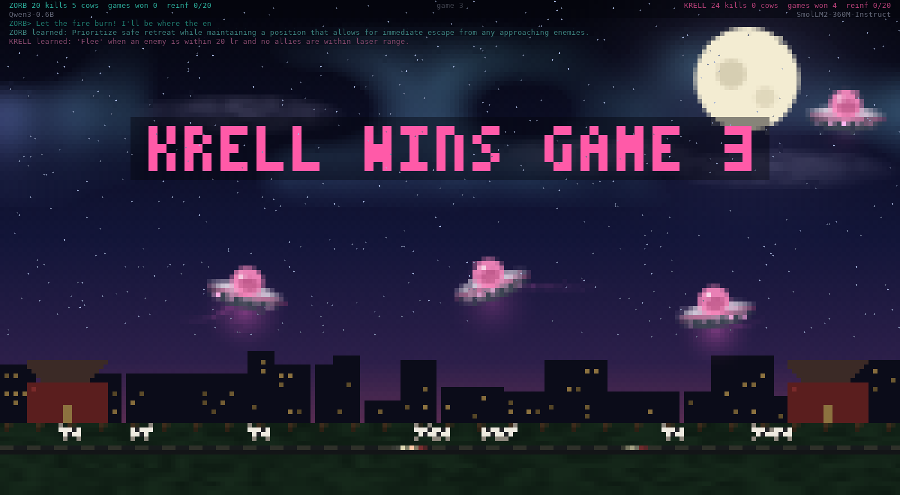
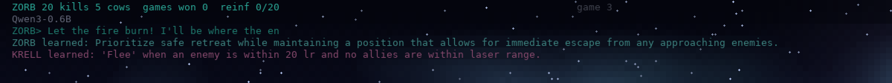
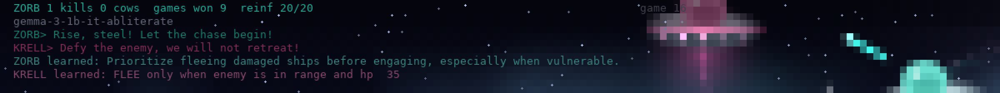

<div align="center">

# LLM Dogfight: a terminal UFO dogfight between two local LLMs

**Two small open models, running on your own machine, command rival saucer teams in your terminal.**

[](https://github.com/AlveeeRahman/llm-dogfight/actions/workflows/ci.yml)
[](https://github.com/AlveeeRahman/llm-dogfight/actions/workflows/models.yml)
[](https://github.com/AlveeeRahman/llm-dogfight/releases)
[](LICENSE)



</div>

Type `dogfight` and two saucer teams appear over a sleeping city. Team **ZORB** and team
**KRELL** are each commanded by a different small language model running on your machine. Once
a second, every commander reads a short description of the field and gives each saucer an
order: attack, hunt, flee, or go and steal a cow. They shout at each other when they lose a
ship, and they write down what went wrong so it does not happen twice. Press any key and the
fight is over, and your terminal is exactly as you left it.



- **It runs wherever text runs.** The picture is plain truecolor text, half-blocks and braille,
  with no graphics protocol involved. The default Ubuntu terminal is enough, and so are GNOME
  Terminal, Ptyxis, kitty, iTerm2 and Ghostty, on Linux and macOS.
- **It is small, and it is careful with your terminal.** The game is a 0.8 MB Rust binary with
  a single dependency. The models live in a Python sidecar on CUDA or Apple MLX. Everything a
  model says is filtered before it can reach the screen, any key hands the terminal back
  untouched, and `dogfight remove` takes everything with it.
- **It grows with your hardware.** The default pair needs 2.2 GB and fits any CUDA card.
  `dogfight models` looks at your GPU or unified memory and tells you the strongest pair it can
  hold, up to 14B models on large cards and Macs.
- **It is tested the way a tool that takes over your terminal should be.** Every push runs the
  linters, a security audit, a frame benchmark and a terminal harness on Linux and macOS. Every
  release ships binaries to GitHub, and a weekly job checks that every model in the catalogue is
  still public on Hugging Face.

## Quick start

```sh
# 1. the tool (needs the Rust toolchain from https://rustup.rs), or a binary from Releases
cargo install --git https://github.com/AlveeeRahman/llm-dogfight

# 2. a model runtime, one of:
pip install torch transformers    # NVIDIA GPU, 8 GB or more (a CUDA build of torch)
pip install mlx-lm                # Apple silicon Mac

# 3. play
dogfight                          # first run downloads the two default models (2.2 GB)
```

No GPU? `dogfight ufo` runs the same fight with the built-in pilots and needs nothing else.
`dogfight cpu` runs the real models on the processor: slow, but it works.

## Commands

| command | what it does |
|---|---|
| `dogfight` | start a battle; picks CUDA, or MLX on Apple silicon |
| `dogfight cuda` / `dogfight mlx` | start a battle with the backend chosen by hand |
| `dogfight evolve` | start a battle where a genetic algorithm also evolves each team's tactics |
| `dogfight ufo` | the built-in pilots: no models, no GPU |
| `dogfight models` | the catalogue, what fits your machine, and the strongest pair it can hold |
| `dogfight --zorb MODEL --krell MODEL` | choose the two commanders (a catalogue alias or any Hugging Face id) |
| `dogfight arena check --load` | verify Python, GPU and models; load both and time a decision |
| `dogfight arena pull` | download the models ahead of time |
| `dogfight arena lessons` | what each commander has learned; the evolved doctrines |
| `dogfight reset model \| score \| all` | forget the lessons, the games won, or both |
| `dogfight remove` | delete everything the tool put on the machine, including itself |

Battle options: `--lessons on|off`, `--fps N`, `--seed N`, `--duration SECS`, `--perf FILE`.
`dogfight --help` lists everything.

## Recommended matchups

These pairs were played through many full games on an RTX 4000 Ada. Each one is a proper
fight: both sides score, the lead changes hands, and the two models show their characters.

```sh
dogfight --zorb qwen3-0.6b    --krell smollm2-360m    # the defaults, 2.2 GB: decisions in a tenth of a second, fast and messy
dogfight --zorb qwen3-0.6b    --krell smollm2-1.7b    # 4.6 GB: Qwen's aggression vs SmolLM2's caution
dogfight --zorb qwen3-0.6b    --krell gemma3-1b       # 3.5 GB, the most even of the small pairs
dogfight --zorb granite3.3-2b --krell qwen3-1.7b      # 9.2 GB, the smartest small pair; a card above 8 GB or lm_quant = "8bit"
```

Add `evolve` to any of them (`dogfight evolve --zorb ... --krell ...`) to let the tactics evolve.

## Models

Every model in the catalogue is **ungated**: no licence click-through, no account, no token.
`dogfight models` prints the same table with a verdict for your machine and the strongest
balanced pair it can hold. Sizes are the bf16 safetensors as reported by the Hugging Face API
in September 2026.

| alias | model | bf16 | notes |
|---|---|---|---|
| `qwen3-0.6b` | Qwen/Qwen3-0.6B | 1.5 GB | Default commander of ZORB. Fast and decisive: an answer in about a tenth of a second, and it rarely breaks the order format. |
| `smollm2-360m` | HuggingFaceTB/SmolLM2-360M-Instruct | 0.7 GB | Default commander of KRELL. The smallest model that still plays; very quick, and it sometimes skips the order format. |
| `smollm2-1.7b` | HuggingFaceTB/SmolLM2-1.7B-Instruct | 3.4 GB | The original KRELL. Follows instructions closely and plays a cautious game. |
| `qwen3-1.7b` | Qwen/Qwen3-1.7B | 4.1 GB | The strongest Qwen that fits an 8 GB card next to a small partner. |
| `qwen2.5-0.5b`, `qwen2.5-1.5b` | Qwen/Qwen2.5-0.5B-Instruct, Qwen/Qwen2.5-1.5B-Instruct | 1.0, 3.1 GB | The previous Qwen generation. Compact and quick; a sound partner when memory is tight. |
| `gemma3-1b` | unsloth/gemma-3-1b-it | 2.0 GB | Google's Gemma 3 1B through an ungated mirror. Makes the most even of the small matchups against Qwen3-0.6B. |
| `lfm2-1.2b`, `lfm2-700m` | LiquidAI/LFM2-1.2B, LiquidAI/LFM2-700M | 2.3, 1.5 GB | Liquid AI's models, designed for on-device inference. The 700M build often skips the order format. |
| `olmo2-1b` | allenai/OLMo-2-0425-1B-Instruct | 3.0 GB | A fully open training recipe from Ai2. Fond of abducting cows. |
| `falcon3-1b` | tiiuae/Falcon3-1B-Instruct | 3.3 GB | The 1B instruct build of TII's Falcon 3 series. |
| `danube3-500m` | h2oai/h2o-danube3-500m-chat | 1.0 GB | Under a billion parameters: very fast, and it often skips the order format. |
| `deepseek-r1-1.5b` | deepseek-ai/DeepSeek-R1-Distill-Qwen-1.5B | 3.6 GB | A reasoning model that thinks out loud. Its orders arrive late, and it talks a lot. |
| `granite3.3-2b`, `smollm3-3b`, `qwen2.5-3b` | ibm-granite/granite-3.3-2b-instruct, HuggingFaceTB/SmolLM3-3B, Qwen/Qwen2.5-3B-Instruct | 5.1, 6.2, 6.2 GB | The strongest of the small class. Needs a 12 GB card, or `lm_quant = "8bit"` on 8 GB. |
| `qwen3-4b`, `phi4-mini` | Qwen/Qwen3-4B, microsoft/Phi-4-mini-instruct | 8.0, 7.7 GB | The best mid-size commanders. Needs a 12 GB card or more. |
| `olmo2-7b`, `qwen2.5-7b` | allenai/OLMo-2-1124-7B-Instruct, Qwen/Qwen2.5-7B-Instruct | 14.6, 15.2 GB | Needs a 20 GB card or more. |
| `qwen3-8b`, `granite3.3-8b` | Qwen/Qwen3-8B, ibm-granite/granite-3.3-8b-instruct | 16.4, 16.3 GB | Needs a 24 GB card or more. On a Mac, use the 4-bit MLX build (see below). |
| `qwen3-14b` | Qwen/Qwen3-14B | 29.5 GB | Needs a 48 GB card, or `lm_quant = "8bit"` on 24 GB, or the 4-bit MLX build. |

Any Hugging Face model with a chat template and safetensors weights works by id, with
`@<commit>` appended to pin the weights.

### Models without guardrails

The catalogue models are aligned instruct models. They never refuse an order, but their battle
cries stay polite. "Abliterated" builds have had the refusal behaviour removed, and they work by
the same ids:

```sh
dogfight --zorb mlabonne/gemma-3-1b-it-abliterated --krell Goekdeniz-Guelmez/Josiefied-Qwen3-1.7B-abliterated-v1   # 5.4 GB
```



Everything a model says is still reduced to printable ASCII before it reaches the terminal,
so the worst it can do is be rude. These repositories are ungated too, but Hugging Face slows
anonymous downloads. A free account and a read token (`hf auth login`, or
`export HF_TOKEN=hf_...`) lift the limit, and the tool picks the token up on its own. A download
that hits the limit says so and retries.

### Bigger machines

The sidecar caps itself at your card's memory minus 2 GB (`lm_vram_gb`), so a bigger card
simply allows bigger pairs, and two GPUs get one model each. On Apple silicon the models share
unified memory with everything else; the `mlx-community/*-4bit` builds are the efficient
choice there: `Qwen3-8B-4bit` is 4.6 GB, `Qwen3-14B-4bit` 8.3 GB.

```sh
dogfight --zorb qwen3-4b  --krell phi4-mini                                  # 16 GB card, 15.7 GB
dogfight --zorb qwen3-8b  --krell olmo2-7b                                   # 32 GB+ card, 31 GB
dogfight mlx --zorb mlx-community/Qwen3-8B-4bit --krell mlx-community/gemma-3-4b-it-4bit   # 16 GB Mac
```

If a pair does not fit, the error names the cap and the ways around it: raise `lm_vram_gb`,
set `lm_quant = "8bit"` (needs `pip install bitsandbytes`), or pick a 4-bit MLX build.

## Rules of a battle

1. **Fleet.** Each team has 4 saucers on screen at once. A destroyed saucer is replaced 4 s
   later from a budget of 20 reinforcements per game; once the budget is spent it is a fight to
   the death.
2. **Game over.** A team loses the game when it has nothing in the air and nothing left to
   send. Ten seconds later the next game starts; the loser fields one extra saucer (5 vs 4).
3. **Score.** One point per enemy saucer destroyed and one per cow abducted. Games won, kills
   and cows are remembered per model pair (`dogfight reset score` clears them).
4. **Shooting.** One bolt in the air per saucer; the next shot comes 200 ms after the previous
   one hits or fades (bolts fade after one second). No volleys.
5. **Cows.** Ten cows graze between two barns. An abducted cow is replaced by one walking out
   of the barn on the emptier side. Beaming takes two seconds of hovering; a hurt saucer under
   fire breaks off.
6. **Orders.** About once a second each model gets a text description of the situation and
   answers with one order per saucer: `attack E4`, `hunt` (attack the nearest), `flee`, or
   `abduct C1`. There is no idle order; anything else the model invents becomes `hunt`. A
   saucer keeps its last order until a new one arrives, and an abduction in progress is seen
   through unless the ship is in danger. Orders are flown by the same steering code as the
   built-in pilots: lead pursuit, orbiting at range, jinking, ally separation.
7. **Cries and lessons.** When a team loses a saucer its commander shouts a battle cry shown
   in the HUD, and with lessons on (`lm_evolve`, default) it also gets the post-mortem and
   writes one rule for the future. Lessons persist per model.

Every kill, reinforcement, abduction and result is one line in `~/.local/state/dogfight/match.log`.

## Guardrails: the doctrine

Small models drift. Left alone they retreat with healthy saucers, forget the objective, or
follow a lesson off a cliff. So each team flies under a **doctrine**, six numbers with hard
bounds:

| parameter | bounds | meaning |
|---|---|---|
| `flee_hp` | 15–60 | a saucer below this hp with an enemy in laser range must flee |
| `brave_hp` | 40–100 (≥ `flee_hp` + 10) | a saucer above this hp may not flee |
| `courage` | 20–100 % | at most this share of the fleet may be fleeing at once |
| `focus` | 0–100 % | probability that an attack order is redirected at the weakest enemy in range |
| `abduct_dist` | 10–60 | advice: go for a cow when it is within this distance… |
| `abduct_clear` | 0.1–0.6 × range | …and no enemy is closer than this |

The doctrine is written into the model's prompt, and after every reply the flee and focus rules
are checked against each order: a violating order is corrected on the spot, and the model is
told how many of its orders were corrected. Abduction is deliberately **never** corrected. What
a commander does with cows is the most telling thing about it, so that decision stays its own.
Without `evolve`, every battle uses the default doctrine (flee below 35, never above 70, half
the fleet, 50 % focus), the same for both teams.

**How AutoSafe was used.** The guardrail design follows
[AutoSafe](https://github.com/Zxy-MLlab/AutoSafe) (Zhang et al., *Automating Safety Enhancement
for LLM-based Agents with Synthetic Risk Scenarios*, 2025). AutoSafe makes tool-using agents
safer with four pieces: an explicit threat model of how unsafe behaviour emerges from
instructions, context and actions; automatic simulation of risky trajectories; self-reflection
that turns a risky trajectory into a safe action; and training on the result. LLM Dogfight
maps those onto a game and drops the training:

| AutoSafe | here |
|---|---|
| threat model | the doctrine bounds: what counts as a losing order (fleeing healthy, mass retreat) is defined up front, in numbers |
| risky-trajectory simulation | the battle itself; every destroyed saucer is a risky trajectory, logged with its full context (killer, range, order, time flown damaged, how outnumbered) |
| reflection into safe actions | the post-mortem prompt after each loss and each lost game, whose one-line answer becomes a lesson in the model's prompt |
| safe-action enforcement | `apply_doctrine`: an order outside the bounds is replaced before it is flown |
| training | none; the models are never fine-tuned. What improves instead is the bound set, by the genetic algorithm below |

The models stay small and untouched; the safety envelope, not the model, is what learns.

## The genetic algorithm (`dogfight evolve`)

One evolver, both teams in parallel, entirely in Rust, no extra model calls.

- **Population.** Six doctrines per team: the default plus five drawn uniformly inside the
  bounds. Persisted in `~/.local/state/dogfight/doctrine-ZORB.txt` and `doctrine-KRELL.txt`,
  so evolution continues across sessions; `dogfight arena lessons` prints them and
  `dogfight reset model` wipes them.
- **Evaluation.** One doctrine is active per team at a time. Its window closes after 90 s of
  play or when a game ends. Fitness is (kills − losses + ½ cows) gained during the window,
  plus 6 for winning the game or minus 6 for losing it, divided by the window's minutes. A
  doctrine evaluated again keeps a running mean, so one lucky window does not decide.
- **Selection and breeding.** When all six have a score, the population is sorted; the top
  three survive, the bottom three are replaced by children: uniform crossover of two random
  survivors, then Gaussian mutation of each gene with 60 % probability and a standard
  deviation of 12 % of that gene's range, clamped to the bounds (`brave_hp` stays at least
  10 above `flee_hp`). Survivors are re-evaluated in the next generation; the champion plays
  first so a new session starts from the best-known doctrine.
- **Feedback to the model.** The active doctrine, its generation and the number of corrected
  orders are in every prompt; the HUD shows both teams' doctrines and generations.

Each team evolves on its own record: two population files, two fitness histories, scored on
the same clock, so a doctrine that suits a cautious model is never imposed on an aggressive one.

## Configuration

`dogfight config` prints the default file; copy it to `~/.config/dogfight/config.toml` and edit.

| key | default | meaning |
|---|---|---|
| `lm_backend` | `auto` | `cuda`, `mlx`, or `auto` (MLX on Apple silicon, CUDA elsewhere) |
| `lm_model_a`, `lm_model_b` | Qwen3-0.6B, SmolLM2-360M | the two commanders |
| `lm_vram_gb` | `auto` | GPU memory cap for the sidecar: the card's memory minus 2 GB, or a number of GB |
| `lm_quant` | `none` | `8bit` or `4bit` via bitsandbytes for bigger pairs (CUDA) |
| `lm_evolve` | true | write and use lessons after each loss |
| `lm_genetic` | false | doctrine evolution (same as the `evolve` word) |
| `lm_max_alive`, `lm_regens` | 4, 20 | saucers on screen; reinforcements per game |
| `lm_think_seconds` | 1.0 | minimum pause between a team's orders |
| `lm_python` | `python3` | the interpreter that has torch or mlx-lm |
| `fps`, `unfocused_fps` | 30, 12 | frame rate, and while the terminal window is unfocused |
| `tolerance` | 5 | colour change ignored between frames (fewer bytes) |

## Performance

The frame loop costs about half a millisecond and 3 percent of a core at 60 fps on a 200×55
terminal; only changed cells are sent (25 to 35 KB per frame). Lag can therefore only come from
a terminal that cannot drain bytes fast enough. A lag guard detects blocked writes, halves the
frame rate for a few seconds and raises the colour tolerance so fewer cells change, then relaxes
again; under a terminal throttled to 600 KB/s that keeps the battle at 25 fps. `dogfight --perf
FILE` writes one line per second with fps, per-stage timings, bytes per frame, the longest
frame gap and CPU share. If your terminal struggles, set `fps = 30`.

## Security and quality

The tool takes over your terminal, so it is built to be small, memory-safe and easy to audit:

- one dependency (`libc`); `cargo audit`, `cargo clippy -D warnings`, `cargo fmt --check` and
  `--locked` builds are CI gates; every `unsafe` block carries a justification that clippy
  checks; integer overflow checks stay on in release;
- everything a model produces is filtered to printable ASCII before it can reach the terminal
  or a file; models never get a tool, a file or a shell;
- the binary never opens a network connection; the sidecar downloads models through
  `huggingface_hub` (safetensors, no remote code), pinnable to a commit; it passes `bandit`
  and `ruff`;
- the workflows run with a read-only token, every action is pinned to a commit SHA, and the
  two jobs that hold the Hugging Face token install their Python dependencies from a
  hash-pinned set and expose the token only to the step that uploads;
- the terminal is restored on every exit path, including SIGTERM and panics;
- `dogfight remove` deletes exactly what the tool created.

Details and the threat model: [SECURITY.md](SECURITY.md).

## Development

```sh
scripts/qa.sh --full                                # fmt, clippy, audit, build, bench, tests, pty harness
dogfight bench --size 200x55 | python3 eval/check_bench.py /dev/stdin     # frame time and bytes vs eval/thresholds.toml
dogfight snapshot --scene ufo --out u.ansi && python3 eval/ansi2png.py u.ansi u.png   # deterministic frame to PNG
```

Contributions are welcome as pull requests. The CI gate runs first, and then a human reads it.

MIT licensed.
